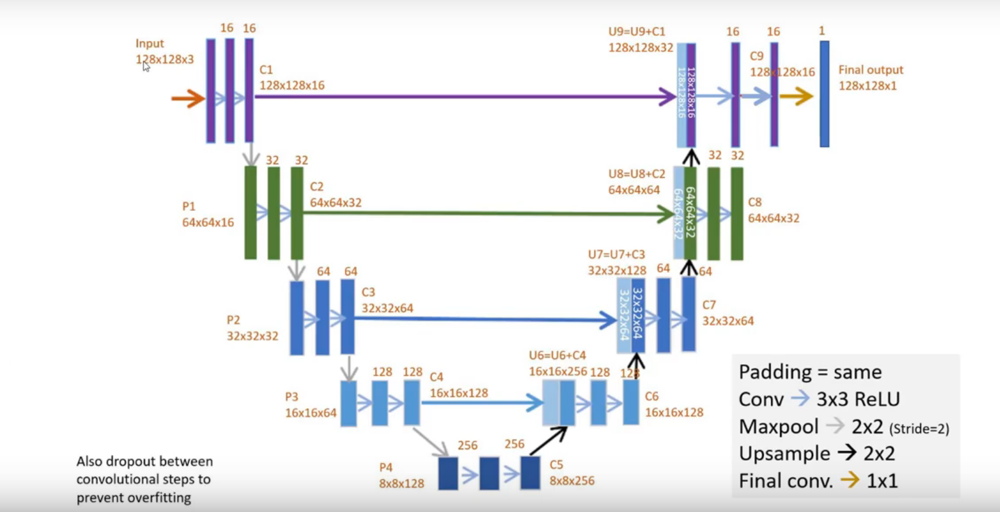

# UNET
Learning and applying the UNET architecture for segmenting biomedical images.
## todo:
use sequential in keras to define it in simpler ways

### The architecture implemented in `unet.py` : 

# References
* [tutorial](https://www.youtube.com/watch?v=68HR_eyzk00)

